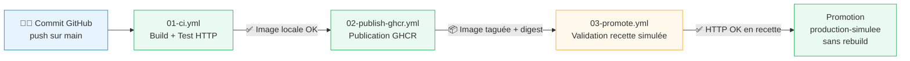

# 02 - Schéma de la chaîne CI/CD

## Schéma logique

## Explication de chaque étape

### 1. Commit GitHub
Le développeur (moi) envoie une modification vers la branche `main`. Ce push déclenche automatiquement les workflows configurés avec `on: push`.

### 2. 01-ci.yml — Build et test automatisé
Ce workflow s'exécute sur chaque push ou pull request.
- Il vérifie la présence des fichiers obligatoires (`Dockerfile`, `compose.yml`, `site/index.html`, `site/version.json`, `docs/08-compte-rendu-final.md`).
- Il valide la syntaxe de `compose.yml` avec `docker compose config`.
- Il construit l'image Docker avec le SHA du commit comme tag.
- Il lance un conteneur et teste HTTP avec `curl` (index et version.json).
- Il génère un résumé visible dans l'interface GitHub Actions.

### 3. 02-publish-ghcr.yml — Publication GHCR
Ce workflow s'exécute uniquement sur la branche `main`.
- Il se connecte à GitHub Container Registry avec le `GITHUB_TOKEN` (aucun secret manuel).
- Il construit et publie l'image avec deux tags : `sha-<commit>` et `latest`.
- Il expose le digest SHA256 de l'image dans le résumé du workflow.

### 4. 03-promote.yml — Validation recette et promotion
Ce workflow est déclenché manuellement (`workflow_dispatch`) avec le tag à promouvoir en paramètre.
- **Job 1** (`validate-recette`) : pull de l'image existante, test HTTP dans l'environnement GitHub `recette`.
- **Job 2** (`promote-production-simulee`) : re-tag de l'image vers `production-simulee` et push dans GHCR — **aucun rebuild**.

## Orchestration légère

Le fichier `compose.yml` décrit deux services :
- `web` : le serveur Nginx servant le site statique.
- `tester` : un conteneur `curlimages/curl` qui attend le démarrage de `web` et valide les endpoints HTTP.

Il sert à documenter et simuler une coordination de conteneurs (compétence C13), en montrant la dépendance entre services (`depends_on`), l'isolation réseau (`cicd_net`) et les tests automatisés au niveau local.

## Limite importante

Docker Compose est un outil d'orchestration légère adapté au développement, aux tests locaux et aux démonstrations pédagogiques. En production réelle, il présente des limites fondamentales :

| Besoin production | Docker Compose | Kubernetes |
|---|---|---|
| Haute disponibilité | ❌ | ✅ |
| Répartition de charge | ❌ | ✅ |
| Auto-healing | ❌ | ✅ |
| Déploiement progressif | ❌ | ✅ |
| Supervision intégrée | ❌ | ✅ (via Prometheus/Grafana) |
| Scaling automatique (HPA) | ❌ | ✅ |

**Conclusion** : Docker Compose permet de valider le concept d'orchestration, mais une vraie production nécessiterait Kubernetes (ou un équivalent géré : EKS, GKE, AKS), avec une politique de déploiement (rolling update, blue/green, canary), une supervision et des mécanismes de rollback automatisés.
